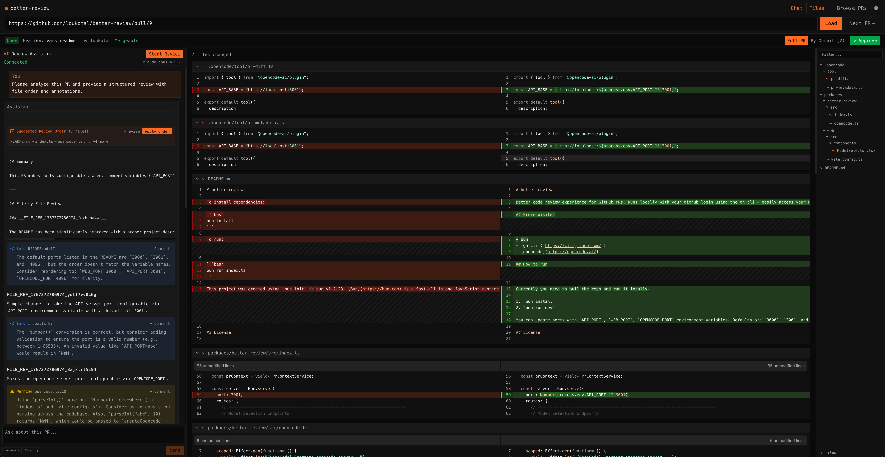

  

Better code review experience for GitHub PRs. Runs locally with your github login using the gh cli - easily access your PRs, data stays local. Integrates with OpenCode for ai-assisted code review.

## Features

- Review code from a GitHub link you have access to
- Post comments to GitHub
- View and filter PRs assigned to you
- All data stays local except for ai conversations through OpenCode
- change diff theme and font (uses local fonts)

### AI Assisted Code Review

- Agent proposes order in which to review files
- Special rendered blocks with info/warning/critical hints
- [future] there could be some "knowledge-base" the agent could use for the review

## Prerequisites

- bun
- [gh cli](https://cli.github.com/) & be logged in
- [OpenCode](https://opencode.ai/)

## How to run

Currently you need to pull the repo and run it locally.

1. `bun install`
2. `bun run dev`

You can update ports with `API_PORT`, `WEB_PORT`, `OPENCODE_PORT` environment variables. Defaults are `3000`, `3001` and `4096`

## TODOs (& limitations & ideas)

- [ ] render images
- [ ] fix file refs from the review agent
- [ ] virtualization for large files - ~7k line file takes long time to load
- [ ] sometimes first message from OpenCode does not get sent
- [ ] better handle SSE connection
- [ ] load opencode sessions based on PR link - allow switching between sessions if multiple exist
- [ ] handle "project knowledge base"
- [ ] simpler marks for warning/info UI elements & files (just use filenames instead of \[\[\]\])
- [ ] better responsive ui
- [ ] make it executable using bun
- [ ] start web server on ".local" domain(?)
- [ ] integrate with other coding agents(?)

## License

Licensed under [MIT](LICENSE).

## Acknowledgements

Claude Opus 4.5 carried this.
Thanks to [OpenCode](https://opencode.ai/), [Effect](effect.website), [diffs](https://diffs.com/), [Solid](https://www.solidjs.com/) and to everyone contributing.
