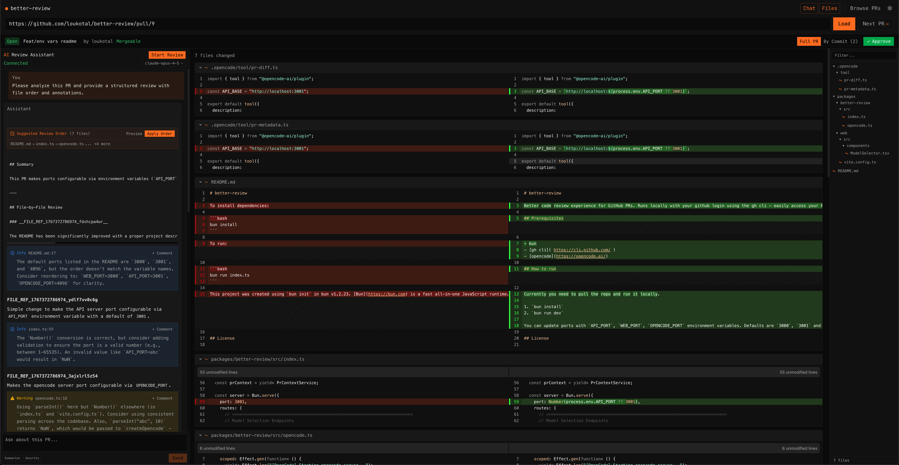

<p align="center">
  
</p>

Better code review experience for GitHub PRs. Runs locally with your github login using the gh cli - easily access your PRs, data stays local. Integrates with OpenCode for ai-assisted code review.



## Features

- Review code from a GitHub link you have access to
- Post comments to GitHub
- View and filter PRs assigned to you
- All data stays local except for ai conversations through OpenCode
- change diff theme and font (uses local fonts)

### AI Assisted Code Review

- Agent proposes order in which to review files
- Special rendered blocks with info/warning/critical hints
- Custom personality/instructions via `personality.md` file
- [future] there could be some "knowledge-base" the agent could use for the review

### Custom Reviewer Personality

You can customize how the AI reviewer behaves by creating a `personality.md` file in the project root. This file can contain custom instructions, tone preferences, or specific things to look for during review.

Example `personality.md`:

```markdown
You are a strict code reviewer. Focus on:

- Security vulnerabilities and edge cases
- Performance implications
- API contract consistency

Be concise and direct. Use examples when explaining issues.
```

The custom instructions are loaded automatically when starting a review session and take priority over the default instructions.

## Prerequisites

- Node.js 24+
- pnpm
- [gh cli](https://cli.github.com/) & be logged in
- [OpenCode](https://opencode.ai/)

## How to run

Currently you need to pull the repo and run it locally.

1. `pnpm install`
2. `pnpm dev` or `pnpm start`

You can update ports with `API_PORT`, `WEB_PORT` (for dev), `OPENCODE_PORT` environment variables. Defaults are `3000` and `3001`; OpenCode uses a random local port unless you explicitly set `OPENCODE_PORT`.

## Agent Review CLI

The repo now exposes a local `better-review` CLI entrypoint for agent review sessions.

Examples:

1. `pnpm exec tsx index.ts plan < AGENT_REVIEW_PLAN.md`
2. `pnpm exec tsx index.ts last --file message.md`
3. `pnpm exec tsx index.ts review`
4. `pnpm exec tsx index.ts open-session <session-id>`

Current flow:

- create a local review session through the API
- open or print a browser URL for `/agent-review/:sessionId`
- wait for approve / request changes
- emit structured JSON to stdout with raw result fields plus:
  - `feedbackMarkdown` for mode-specific exported feedback
  - `agentMessage` for a ready-to-send runtime-facing message

For now, keep the app running with `pnpm dev` or `pnpm start` before using the CLI.

### Local Command Install

To expose `better-review` as a machine-local command for other repos and plugins:

```bash
./scripts/install-local-command.sh
```

This installs a launcher at `~/.local/bin/better-review` that runs this repo's `index.ts` via `pnpm exec tsx`.

### OpenCode Plugin Example

See [examples/opencode-better-review-plugin.ts](/Users/louky/Work/better-review/examples/opencode-better-review-plugin.ts) for a minimal plugin pattern that:

- shells out to the local `better-review` command
- waits for JSON output
- returns tool results or injects feedback back into the current OpenCode session

### OpenCode Command Examples

Ready-to-copy custom command examples are also available:

- [opencode-better-review-plan-command.md](/Users/louky/Work/better-review/examples/opencode-better-review-plan-command.md)
- [opencode-better-review-last-command.md](/Users/louky/Work/better-review/examples/opencode-better-review-last-command.md)
- [opencode-better-review-diff-command.md](/Users/louky/Work/better-review/examples/opencode-better-review-diff-command.md)

Copy them into `.opencode/commands/` in the target repo and rename them as desired.

## TODOs (& limitations & ideas)

- [ ] render images
- [ ] fix file refs from the review agent
- [ ] virtualization for large files - ~7k line file takes long time to load
- [ ] better handle SSE connection
- [ ] handle "project knowledge base"
- [ ] simpler marks for warning/info UI elements & files (just use filenames instead of \[\[\]\])
- [ ] better responsive ui
- [ ] make the CLI install flow more ergonomic
- [ ] start web server on ".local" domain(?)
- ~[ ] integrate with other coding agents(?)~
- [x] load opencode sessions based on PR link - allow switching between sessions if multiple exist
- [x] sometimes first message from OpenCode does not get sent

## License

Licensed under [MIT](LICENSE).

## Acknowledgements

Claude Opus 4.5 carried this.
Thanks to [OpenCode](https://opencode.ai/), [Effect](effect.website), [diffs](https://diffs.com/), [Solid](https://www.solidjs.com/) and to everyone contributing.
